# FORM-I Validation Service - Technical Architecture

## System Overview

A FastAPI-based microservice that validates Ministry of Coal S&T grant proposals (FORM-I) using hybrid rule-based + LLM validation against official guidelines.

---

## System Flow Architecture

```
+----------------------+       +----------------------+       +----------------------+
|    Frontend UI       |------>|   Backend Server     |------>|  Validation Engine   |
| (Next.js Client)     |       | (FastAPI/Express)    |       | (Hybrid Rules + LLM) |
+----------------------+       +----------------------+       +----------------------+
          |                              |                              |
          |                              |                              |
          v                              v                              v
+----------------------+       +----------------------+       +----------------------+
| 1. User uploads a    |       | 2. Server processes  |       | 3. Validation engine |
|    proposal form     |       |    the request and   |       |    checks fields     |
|    (PDF/DOCX/TXT)    |       |    extracts text via |       |    against Ministry  |
|                      |       |    PyPDF2/docx, then |       |    of Coal S&T       |
+----------------------+       |    calls Gemini AI   |       |    Guidelines.pdf    |
                               |    to extract FORM-I |       |                      |
                               |    structured JSON.  |       +----------------------+
                               |    Stores file in    |
                               |    Supabase Storage  |              |
                               |    and metadata in   |              |
                               |    proposals table.  |              v
                               +----------------------+       +----------------------+
                                        |                     | 4. Returns detailed  |
                                        |                     |    validation_result |
                                        v                     |    with field-level  |
                               +----------------------+       |    pass/fail status  |
                               | 5. Server returns    |       |    and reasons based |
                               |    complete response |       |    on deterministic  |
                               |    with validation_  |<------|    rules + LLM       |
                               |    result, extracted_|       |    qualitative check |
                               |    data, and raw_    |       +----------------------+
                               |    extracted JSON    |
                               +----------------------+
                                        |
                                        |
                                        v
                               +----------------------+
                               | 6. Frontend polls    |
                               |    GET /latest-result|
                               |    to retrieve and   |
                               |    auto-render the   |
                               |    validation report |
                               +----------------------+
```

---

## High-Level Architecture Diagram

```mermaid
graph TB
    subgraph "Client Layer"
        FE[Frontend Application]
        API_CLIENT[API Client]
    end

    subgraph "API Layer - FastAPI"
        ROUTER[APIRouter<br/>/validation]
        EP1[POST /validate-form1]
        EP2[GET /latest-result]
        EP3[GET /health]
        UPLOAD[UploadFile Handler]
        RESPONSE[JSONResponse Builder]
    end

    subgraph "Extraction Layer"
        FILE_PARSER[File Parser]
        PDF[PyPDF2<br/>PDF Reader]
        DOCX[python-docx<br/>DOCX Parser]
        TXT[chardet<br/>Text Decoder]
        
        AI_EXTRACT[AI Extractor]
        GEMINI_EXTRACT[Gemini 2.5 Flash Lite<br/>extract_form_data_with_ai]
        
        NORMALIZE[Normalizer<br/>construct_simple_json_structure]
        CLEAN[clean_text_field]
    end

    subgraph "Validation Layer - Hybrid Engine"
        VAL_ROUTER{Validation Router}
        
        RULE_ENGINE[Rule-Based Validator<br/>rule_based_check]
        RULE_SET[GUIDELINE_RULES<br/>VALIDATE_FIELDS<br/>PLACEHOLDER_RE]
        
        LLM_ENGINE[LLM Validator<br/>ask_gemini_validate]
        GEMINI_VAL[Gemini 2.5 Flash Lite]
        
        FALLBACK[Deterministic Fallback<br/>deterministic_llm_fallback]
        
        MAPPER[Field Mapper<br/>get_value_from_extracted_payload]
    end

    subgraph "Guidelines Processing"
        GUIDE_LOAD[load_guidelines_text<br/>pdfplumber]
        GUIDE_EXCERPT[build_guideline_excerpts<br/>Keyword-based RAG]
        GUIDE_PDF[(Guidelines.pdf)]
    end

    subgraph "Persistence Layer - Supabase"
        STORAGE[Supabase Storage<br/>UPLOAD_BUCKET]
        DATABASE[(Supabase DB<br/>proposals table)]
        STORE_FUNC[store_in_supabase]
    end

    subgraph "State Management"
        MEM_CACHE[latest_validation_result<br/>In-Memory Cache]
    end

    subgraph "External Services"
        GEMINI_API[Google Gemini API<br/>generativeai]
        SUPABASE_API[Supabase API<br/>REST + Storage]
    end

    %% Client interactions
    FE -->|Upload PDF/DOCX/TXT| EP1
    API_CLIENT -->|Poll for results| EP2
    API_CLIENT -->|Health check| EP3

    %% API routing
    EP1 --> UPLOAD
    EP2 --> MEM_CACHE
    EP3 --> RESPONSE

    %% File processing flow
    UPLOAD -->|file_bytes| FILE_PARSER
    FILE_PARSER -->|.pdf| PDF
    FILE_PARSER -->|.docx| DOCX
    FILE_PARSER -->|.txt/.csv| TXT
    PDF --> AI_EXTRACT
    DOCX --> AI_EXTRACT
    TXT --> AI_EXTRACT

    %% AI extraction flow
    AI_EXTRACT --> GEMINI_EXTRACT
    GEMINI_EXTRACT -->|Prompt| GEMINI_API
    GEMINI_API -->|JSON Response| AI_EXTRACT
    AI_EXTRACT -->|proposal_data| NORMALIZE
    NORMALIZE -->|json_structure| MAPPER
    CLEAN -.->|Used by| NORMALIZE

    %% Guidelines processing
    GUIDE_PDF -->|Read| GUIDE_LOAD
    GUIDE_LOAD -->|Full text| GUIDE_EXCERPT
    GUIDE_EXCERPT -->|Per-field excerpts| LLM_ENGINE

    %% Validation flow
    MAPPER --> VAL_ROUTER
    VAL_ROUTER -->|Has deterministic rules| RULE_ENGINE
    VAL_ROUTER -->|Qualitative check needed| LLM_ENGINE
    
    RULE_SET -.->|Constraints| RULE_ENGINE
    LLM_ENGINE -->|Prompt + Excerpt| GEMINI_VAL
    GEMINI_VAL -->|Validation| GEMINI_API
    GEMINI_API -->|Result| LLM_ENGINE
    
    LLM_ENGINE -->|On failure| FALLBACK
    FALLBACK --> VAL_ROUTER
    RULE_ENGINE --> VAL_ROUTER
    
    VAL_ROUTER -->|validation_result| RESPONSE

    %% Persistence flow
    NORMALIZE -.->|Optional| STORE_FUNC
    UPLOAD -.->|Original file| STORAGE
    STORAGE -->|API Call| SUPABASE_API
    STORE_FUNC -->|Insert proposal| DATABASE
    DATABASE -->|API Call| SUPABASE_API

    %% Response flow
    RESPONSE -->|Update| MEM_CACHE
    RESPONSE -->|JSON| FE

    %% Styling
    classDef apiLayer fill:#e1f5ff,stroke:#01579b,stroke-width:2px
    classDef extractLayer fill:#f3e5f5,stroke:#4a148c,stroke-width:2px
    classDef valLayer fill:#fff3e0,stroke:#e65100,stroke-width:2px
    classDef dataLayer fill:#e8f5e9,stroke:#1b5e20,stroke-width:2px
    classDef external fill:#ffebee,stroke:#b71c1c,stroke-width:2px

    class ROUTER,EP1,EP2,EP3,UPLOAD,RESPONSE apiLayer
    class FILE_PARSER,PDF,DOCX,TXT,AI_EXTRACT,GEMINI_EXTRACT,NORMALIZE,CLEAN extractLayer
    class VAL_ROUTER,RULE_ENGINE,RULE_SET,LLM_ENGINE,GEMINI_VAL,FALLBACK,MAPPER valLayer
    class STORAGE,DATABASE,STORE_FUNC,GUIDE_PDF,MEM_CACHE dataLayer
    class GEMINI_API,SUPABASE_API external
```



---

## Component Interaction Architecture

```
┌─────────────────────────────────────────────────────────────────────────────────────┐
│                              FORM-I VALIDATION SERVICE                               │
└─────────────────────────────────────────────────────────────────────────────────────┘

┌──────────────────┐          ┌──────────────────┐          ┌──────────────────┐
│   API Gateway    │          │  File Processing │          │   AI Extraction  │
│   (FastAPI)      │─────────▶│   Pipeline       │─────────▶│   (Gemini API)   │
│                  │          │                  │          │                  │
│ • POST /validate │          │ • PyPDF2 (PDF)   │          │ • Text→JSON      │
│ • GET /latest    │          │ • python-docx    │          │ • Schema-based   │
│ • GET /health    │          │ • chardet (TXT)  │          │   Extraction     │
└──────────────────┘          └──────────────────┘          └──────────────────┘
         │                              │                              │
         │                              │                              │
         ▼                              ▼                              ▼
┌──────────────────┐          ┌──────────────────┐          ┌──────────────────┐
│  Temp File Mgmt  │          │   Normalizer     │          │ Structured JSON  │
│                  │          │                  │          │                  │
│ • tempfile.Named │          │ • clean_text_    │          │ • basic_info     │
│   TemporaryFile  │          │   field()        │          │ • project_details│
│ • Cleanup in     │          │ • construct_     │          │ • cost_breakdown │
│   finally block  │          │   simple_json_   │          │ • additional_info│
└──────────────────┘          │   structure()    │          └──────────────────┘
                               └──────────────────┘                    │
                                        │                              │
                                        └──────────────┬───────────────┘
                                                       │
                                                       ▼
                                          ┌─────────────────────┐
                                          │  Validation Router  │
                                          │                     │
                                          │ • get_value_from_   │
                                          │   extracted_payload │
                                          │ • Field mapping     │
                                          └─────────────────────┘
                                                       │
                        ┌──────────────────────────────┼──────────────────────────────┐
                        │                              │                              │
                        ▼                              ▼                              ▼
            ┌───────────────────┐        ┌───────────────────┐        ┌───────────────────┐
            │ Rule-Based Engine │        │  LLM Validator    │        │ Deterministic     │
            │                   │        │                   │        │ Fallback          │
            │ • GUIDELINE_RULES │        │ • ask_gemini_     │        │                   │
            │ • PLACEHOLDER_RE  │        │   validate()      │        │ • Simple checks   │
            │ • count_words()   │        │ • Guideline       │        │ • Pattern match   │
            │ • parse_objectives│        │   excerpts (RAG)  │        │ • Conservative    │
            │ • Regex patterns  │        │ • Qualitative     │        │   approval        │
            └───────────────────┘        └───────────────────┘        └───────────────────┘
                        │                              │                              │
                        └──────────────────────────────┼──────────────────────────────┘
                                                       │
                                                       ▼
                                          ┌─────────────────────┐
                                          │ Result Aggregator   │
                                          │                     │
                                          │ • Overall validation│
                                          │ • Missing columns   │
                                          │ • Failing columns   │
                                          │ • Field-level status│
                                          └─────────────────────┘
                                                       │
                        ┌──────────────────────────────┼──────────────────────────────┐
                        │                              │                              │
                        ▼                              ▼                              ▼
            ┌───────────────────┐        ┌───────────────────┐        ┌───────────────────┐
            │ Supabase Storage  │        │ In-Memory Cache   │        │ Response Builder  │
            │                   │        │                   │        │                   │
            │ • Upload file     │        │ • latest_         │        │ • JSONResponse    │
            │ • Store metadata  │        │   validation_     │        │ • Status codes    │
            │ • Get public URL  │        │   result (global) │        │ • Error handling  │
            │ • proposals table │        │ • Polling support │        │ • Logging         │
            └───────────────────┘        └───────────────────┘        └───────────────────┘


┌─────────────────────────────────────────────────────────────────────────────────────┐
│                              EXTERNAL DEPENDENCIES                                   │
├─────────────────────────────────────────────────────────────────────────────────────┤
│                                                                                      │
│  ┌──────────────────┐     ┌──────────────────┐     ┌──────────────────┐            │
│  │  Google Gemini   │     │  Supabase Cloud  │     │  Guidelines.pdf  │            │
│  │  API             │     │                  │     │                  │            │
│  │                  │     │ • PostgreSQL DB  │     │ • pdfplumber     │            │
│  │ • gemini-2.5-    │     │ • Storage Bucket │     │ • Keyword search │            │
│  │   flash-lite     │     │ • REST API       │     │ • Sentence window│            │
│  │ • Extraction     │     │ • RLS Policies   │     │ • Context extract│            │
│  │ • Validation     │     │                  │     │                  │            │
│  └──────────────────┘     └──────────────────┘     └──────────────────┘            │
│                                                                                      │
└─────────────────────────────────────────────────────────────────────────────────────┘
```

---

## Data Flow Through Layers

```
REQUEST (Upload PDF/DOCX/TXT)
    │
    ├──▶ [API Layer]
    │       │
    │       ├──▶ Validate file extension (.pdf, .docx, .txt)
    │       ├──▶ Save to tempfile.NamedTemporaryFile
    │       └──▶ Read file_bytes
    │
    ├──▶ [Extraction Layer]
    │       │
    │       ├──▶ extract_text_from_file(filename, file_bytes)
    │       │       │
    │       │       ├──▶ If PDF: PyPDF2.PdfReader → iterate pages → extract_text()
    │       │       ├──▶ If DOCX: docx.Document → paragraphs → join text
    │       │       └──▶ If TXT: chardet.detect → decode(encoding)
    │       │
    │       ├──▶ extract_form_data_with_ai(extracted_text)
    │       │       │
    │       │       ├──▶ Build FORM-I extraction prompt
    │       │       ├──▶ Call Gemini API (generate_content)
    │       │       ├──▶ Parse JSON response (clean ```json markers)
    │       │       └──▶ Return proposal_data (40+ fields)
    │       │
    │       └──▶ construct_simple_json_structure(proposal_data)
    │               │
    │               ├──▶ Apply clean_text_field to all strings
    │               └──▶ Build hierarchical JSON (basic_info, project_details, etc.)
    │
    ├──▶ [Persistence Layer] (Optional - Supabase)
    │       │
    │       ├──▶ Upload file to UPLOAD_BUCKET
    │       ├──▶ Get public_url
    │       └──▶ Insert into proposals table (store_in_supabase)
    │
    ├──▶ [Guidelines Layer]
    │       │
    │       ├──▶ load_guidelines_text(GUIDELINES_PDF_PATH)
    │       │       │
    │       │       └──▶ pdfplumber.open → extract_text per page
    │       │
    │       └──▶ build_guideline_excerpts(guidelines_text, VALIDATE_FIELDS)
    │               │
    │               ├──▶ Split into sentences
    │               ├──▶ Keyword search per field
    │               └──▶ Return 2-sentence context window
    │
    ├──▶ [Validation Layer] (Loop through VALIDATE_FIELDS)
    │       │
    │       For each field in ["Project Title", "Principal Investigator", ...]:
    │       │
    │       ├──▶ get_value_from_extracted_payload(json_structure, field_label)
    │       │       │
    │       │       ├──▶ Try structured paths (basic_information.project_title)
    │       │       └──▶ Fallback to flat key fuzzy match
    │       │
    │       ├──▶ Check if value empty → not_filled
    │       ├──▶ Check PLACEHOLDER_RE → not_following_guidelines
    │       │
    │       ├──▶ If field in GUIDELINE_RULES:
    │       │       │
    │       │       └──▶ rule_based_check(field_label, value)
    │       │               │
    │       │               ├──▶ Project Title: count_words ≤ 60
    │       │               ├──▶ Objectives: parse_objectives → 2-5 items, list format
    │       │               ├──▶ Work Plan: min_words + keyword check (Phase|Milestone)
    │       │               ├──▶ Methodology: min_words + keyword check (technique|method)
    │       │               └──▶ Return {validation_result, reason}
    │       │
    │       └──▶ Else (no deterministic rule):
    │               │
    │               └──▶ ask_gemini_validate(field_label, value, guideline_excerpt)
    │                       │
    │                       ├──▶ Build validation prompt with field + excerpt
    │                       ├──▶ Call Gemini API
    │                       ├──▶ Parse JSON {validation_result, reason}
    │                       └──▶ On failure → deterministic_llm_fallback
    │
    ├──▶ [Aggregation Layer]
    │       │
    │       ├──▶ Collect all field results
    │       ├──▶ Build columns_missing_value (not_filled)
    │       ├──▶ Build columns_not_following_guidelines (violations)
    │       └──▶ Compute overall_validation (False if any missing/failing)
    │
    ├──▶ [Response Layer]
    │       │
    │       ├──▶ Build final JSON response:
    │       │       {
    │       │         "validation_result": {...},
    │       │         "extracted_data": {...},
    │       │         "raw_extracted": {...},
    │       │         "guidelines_used": "Guidelines.pdf"
    │       │       }
    │       │
    │       ├──▶ Update latest_validation_result (in-memory cache)
    │       └──▶ Return JSONResponse(status_code=200)
    │
    └──▶ [Cleanup]
            │
            └──▶ finally: os.remove(temp_path)
```

---

## Component-Level Architecture


---

## Data Flow Diagram


---

## Validation Logic Flow


---

## Technology Stack Breakdown


---

## Domain Model


---

## Deployment Architecture


---

## Error Handling & Resilience


---

## Key Design Patterns

### 1. **Pipeline Pattern**
- Sequential processing: Upload → Parse → Extract → Normalize → Validate → Respond
- Each stage can fail gracefully and fall back

### 2. **Strategy Pattern**
- Validation strategy selected based on field type:
  - Deterministic (rule-based)
  - LLM-based (qualitative)
  - Hybrid (combination)

### 3. **Template Method Pattern**
- `extract_form_data_with_ai` defines extraction template
- `construct_simple_json_structure` normalizes to canonical structure

### 4. **Adapter Pattern**
- `get_value_from_extracted_payload` adapts between:
  - Raw extracted keys
  - Normalized JSON paths
  - Validation field names

### 5. **Fallback Pattern**
- Gemini not configured → empty template extraction
- Gemini validation fails → deterministic fallback
- Supabase not configured → skip persistence
- Guidelines missing → empty guideline text

### 6. **Observer Pattern** (Implicit)
- Frontend polls `GET /latest-result` for updates
- In-memory cache stores latest state

---

## Performance Considerations

| Component | Bottleneck | Mitigation Strategy |
|-----------|------------|---------------------|
| **Gemini API Calls** | Network latency (2-5s per call) | • Batch validation where possible<br/>• Use rule-based checks first<br/>• Cache common validations |
| **PDF Parsing** | Large PDFs (100+ pages) | • Stream processing<br/>• Page-by-page extraction<br/>• Limit guideline text size |
| **Supabase Storage** | File upload time | • Async upload<br/>• Optional (don't block validation)<br/>• Pre-signed URLs |
| **In-Memory State** | Single-process cache | • Redis for multi-instance deployments<br/>• Session-based storage<br/>• Database-backed results |
| **Validation Loop** | O(n) field checks | • Parallel rule checks (thread pool)<br/>• Early exit on critical failures<br/>• Batch Gemini prompts |

---

## Security Architecture


---

## Monitoring & Observability

### Logging Strategy
```python
# Structured logging points:
logger.info("Gemini configured for validation")
logger.warning("SUPABASE_URL not set - supabase operations will be skipped")
logger.error("Error in AI extraction: %s", e)
logger.exception("Validation failed: %s", e)
```

### Key Metrics to Track
1. **Request Metrics**
   - Requests per endpoint
   - Response times (p50, p95, p99)
   - Error rates (4xx, 5xx)

2. **Extraction Metrics**
   - Gemini API latency
   - Extraction success rate
   - Text extraction errors by file type

3. **Validation Metrics**
   - Fields failing validation (by field name)
   - Rule-based vs LLM validation ratio
   - Overall validation pass rate

4. **Integration Metrics**
   - Supabase upload success rate
   - Guidelines PDF load time
   - Gemini API quota usage

### Health Check Response
```json
{
  "status": "running",
  "hybrid_validator": true,
  "guidelines": "Guidelines.pdf",
  "gemini_configured": true,
  "supabase_configured": true
}
```

---

## API Contract

### POST /validation/validate-form1

**Request:**
```http
POST /validation/validate-form1 HTTP/1.1
Content-Type: multipart/form-data

file: <PDF/DOCX/TXT>
```

**Response (200 OK):**
```json
{
  "validation_result": {
    "overall_validation": false,
    "columns_missing_value": ["Time Schedule"],
    "columns_not_following_guidelines": [
      {
        "field": "Objectives",
        "reason": "Objectives must be 2–5 clearly defined and listed. (found 1 objectives)."
      }
    ],
    "fields": [
      {
        "field_name": "Project Title",
        "value": "Sample Project Title",
        "validation_result": "filled_and_ok",
        "reason": "Title length within guideline limit."
      }
    ]
  },
  "extracted_data": {
    "form_type": "FORM-I S&T Grant Proposal",
    "basic_information": { ... },
    "project_details": { ... },
    "cost_breakdown": { ... },
    "additional_information": { ... }
  },
  "raw_extracted": {
    "project_title": "...",
    "definition_of_issue": "..."
  },
  "guidelines_used": "Guidelines.pdf"
}
```

### GET /validation/latest-result

**Response (202 Accepted - Waiting):**
```json
{
  "status": "waiting",
  "message": "No validation has been performed yet"
}
```

**Response (200 OK - Result Available):**
```json
{
  "validation_result": { ... },
  "extracted_data": { ... },
  "raw_extracted": { ... },
  "guidelines_used": "Guidelines.pdf"
}
```

---

## Future Enhancements


---

## Conclusion

This microservice implements a **sophisticated hybrid validation engine** that combines:

1. **Deterministic rule enforcement** (word counts, structure checks, keyword presence)
2. **AI-powered extraction** (Gemini for unstructured → structured transformation)
3. **LLM-guided qualitative validation** (semantic understanding of guidelines)
4. **Graceful degradation** (fallbacks at every layer)
5. **Optional persistence** (Supabase for file storage & metadata)

The architecture is designed to be:
- **Resilient** (works even if Gemini/Supabase unavailable)
- **Extensible** (easy to add new validation rules or fields)
- **Observable** (logging at key decision points)
- **Domain-focused** (closely models FORM-I structure and S&T Guidelines)

---

**Tech Stack Summary:**
`FastAPI` + `Gemini AI` + `PyPDF2` + `pdfplumber` + `Supabase` + `Python typing` + `Hybrid Validation Engine`
